<div align="center">

# RISC-V `RV32I` Processor — Logisim-Evolution

**A complete single-cycle RISC-V CPU, built gate-by-gate.**
Every adder, multiplexer, register and memory is wired by hand — no HDL, no black boxes.

[](https://riscv.org/)
[](https://github.com/logisim-evolution/logisim-evolution)
[](#architecture)
[](#instruction-set)
[](LICENSE)

<br/>

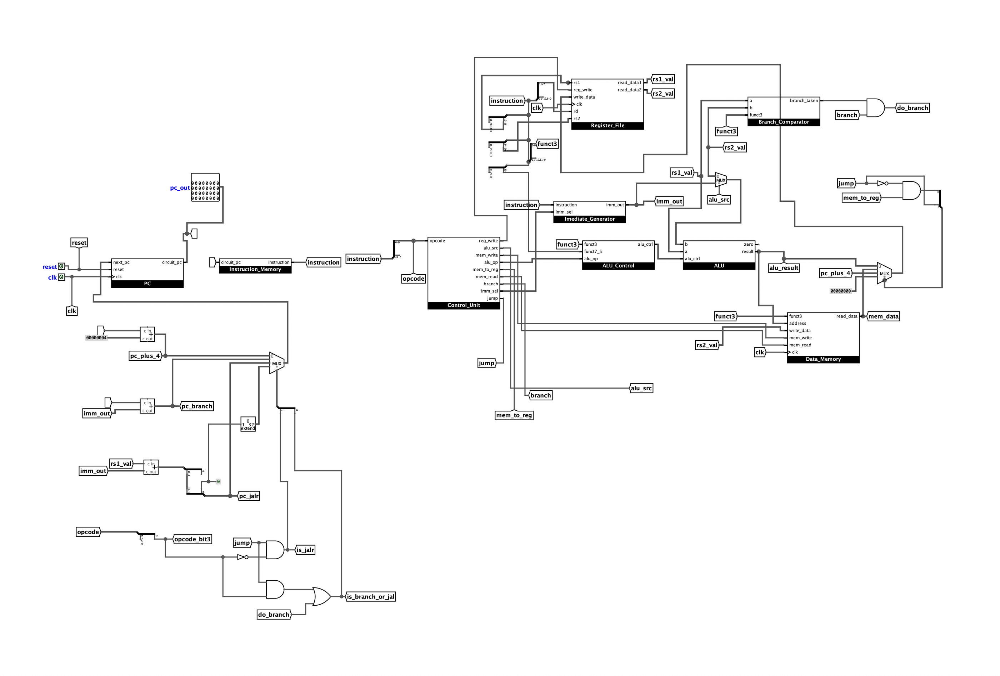

<sub>The complete single-cycle datapath — exported directly from <code>RV32I_CPU.circ</code>.</sub>

</div>

---

This is the submission for **DAC-102 / DAE-101 (2026), Project 2** at the Mehta Family
School of Data Science & Artificial Intelligence, **IIT Roorkee**. It implements the full
**RISC-V `RV32I`** base integer instruction set — every R, I, S, B, U and J-format
instruction — with the only exclusions being `ecall` and `ebreak`, exactly as the
assignment specifies. Each instruction is fetched, decoded, executed, given memory access
and written back **within one clock cycle**.

The file to open and grade is **[`RV32I_CPU.circ`](RV32I_CPU.circ)**.

> **Contents** ·
> [Overview](#at-a-glance) ·
> [Architecture](#architecture) ·
> [Instruction set](#instruction-set) ·
> [Inside the chip](#inside-the-chip) ·
> [Run it](#run-it) ·
> [Verification](#verification) ·
> [Repository](#repository) ·
> [Docs](#documentation)

---

## At a glance

| | |
|---|---|
| **Architecture** | Single-cycle · Harvard (separate instruction & data memory) |
| **ISA** | RISC-V `RV32I` base integer — 37 instructions (no `ecall`/`ebreak`) |
| **Data width** | 32-bit |
| **Registers** | 32 × 32-bit · `x0` hard-wired to zero |
| **Endianness** | Little-endian |
| **Composition** | 10 hierarchical subcircuits · 427 components · 1,315 wires |
| **Tool** | Logisim-Evolution 4.1.0 |

---

## Architecture

The top-level `CPU` circuit wires ten self-contained subcircuits into the classic
five-stage RISC datapath, all active within a single clock cycle. Solid edges carry
data/buses; dashed edges carry control signals from the decoders.

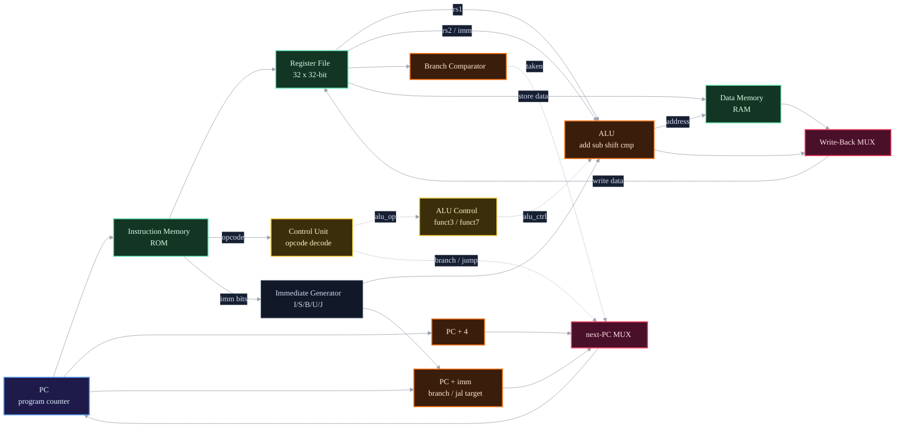

| Stage | Subcircuits | Responsibility |
|-------|-------------|----------------|
| **Fetch** | `PC` · `Instruction_Memory` | Hold the program counter, read the 32-bit instruction, compute `PC+4`. |
| **Decode** | `Control_Unit` · `Imediate_Generator` · `Register_File` | Decode the opcode into control signals, sign-extend the immediate, read `rs1`/`rs2`. |
| **Execute** | `ALU` · `ALU_Control` · `Branch_Comparator` | Compute the arithmetic/logic result; resolve the branch condition. |
| **Memory** | `Data_Memory` | Byte / half / word loads and stores into RAM. |
| **Write-back** | muxing in `CPU` | Write the ALU result, memory data, or `PC+4` back to `rd`. |

---

## Instruction set

All **37** base-integer instructions are supported (everything in `RV32I` except
`ecall`, `ebreak` and `fence`). The `Control_Unit` ROM holds a decode entry for every one
of the nine RV32I opcode groups — `0x03 0x13 0x17 0x23 0x33 0x37 0x63 0x67 0x6F`.

| Format | Instructions |
|:------:|--------------|
| **R** | `add` `sub` `sll` `slt` `sltu` `xor` `srl` `sra` `or` `and` |
| **I** · ALU | `addi` `slti` `sltiu` `xori` `ori` `andi` `slli` `srli` `srai` |
| **I** · load | `lb` `lh` `lw` `lbu` `lhu` |
| **I** · jump | `jalr` |
| **S** · store | `sb` `sh` `sw` |
| **B** · branch | `beq` `bne` `blt` `bge` `bltu` `bgeu` |
| **U** | `lui` `auipc` |
| **J** | `jal` |

---

## Inside the chip

Every diagram below is the **real subcircuit**, exported straight from `RV32I_CPU.circ`
with Logisim-Evolution's own renderer — the same view as the editor canvas, dot grid and
all. Framed labels are named tunnels; blue labels are the circuit's input/output pins.

### Fetch & decode

<table>
<tr>
<td width="50%" valign="top"><b>Program Counter</b><br/><sub>32-bit register with synchronous reset; latches the next-PC each clock edge.</sub><br/>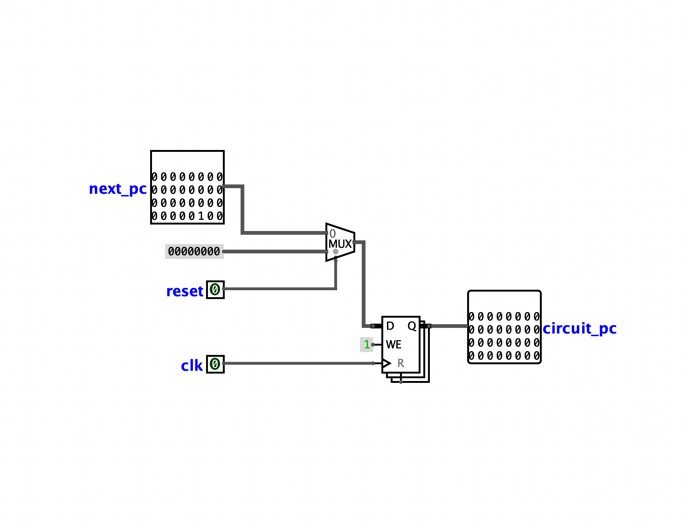</td>
<td width="50%" valign="top"><b>Instruction Memory</b><br/><sub>32-bit-wide ROM holding the program, addressed by the PC.</sub><br/>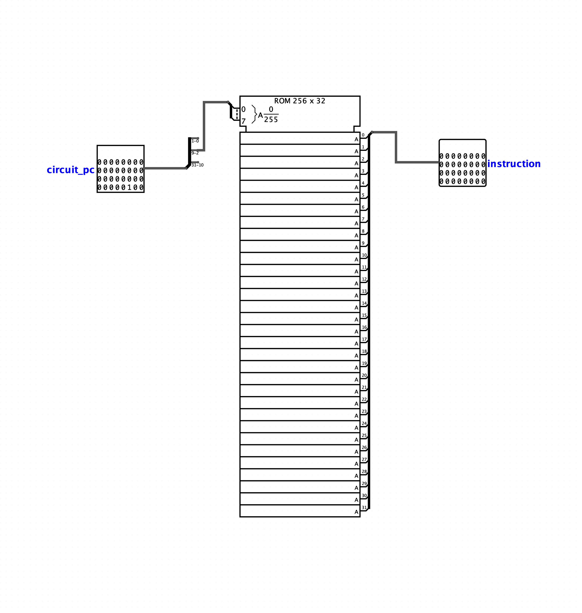</td>
</tr>
</table>

**Control Unit** — a ROM that maps the 7-bit opcode to the full bundle of control signals
(`reg_write`, `alu_src`, `mem_read`, `mem_write`, `mem_to_reg`, `branch`, `jump`,
`alu_op`, `imm_sel`).

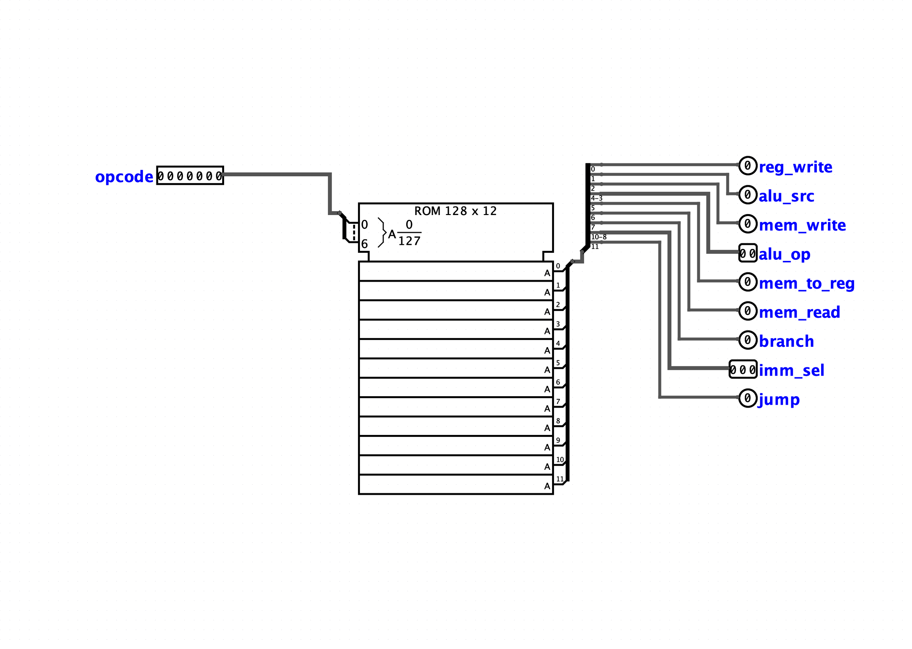

**Immediate Generator** — reassembles and sign-extends the immediate for all five formats
(I/S/B/U/J), selected by the 3-bit `imm_sel`.

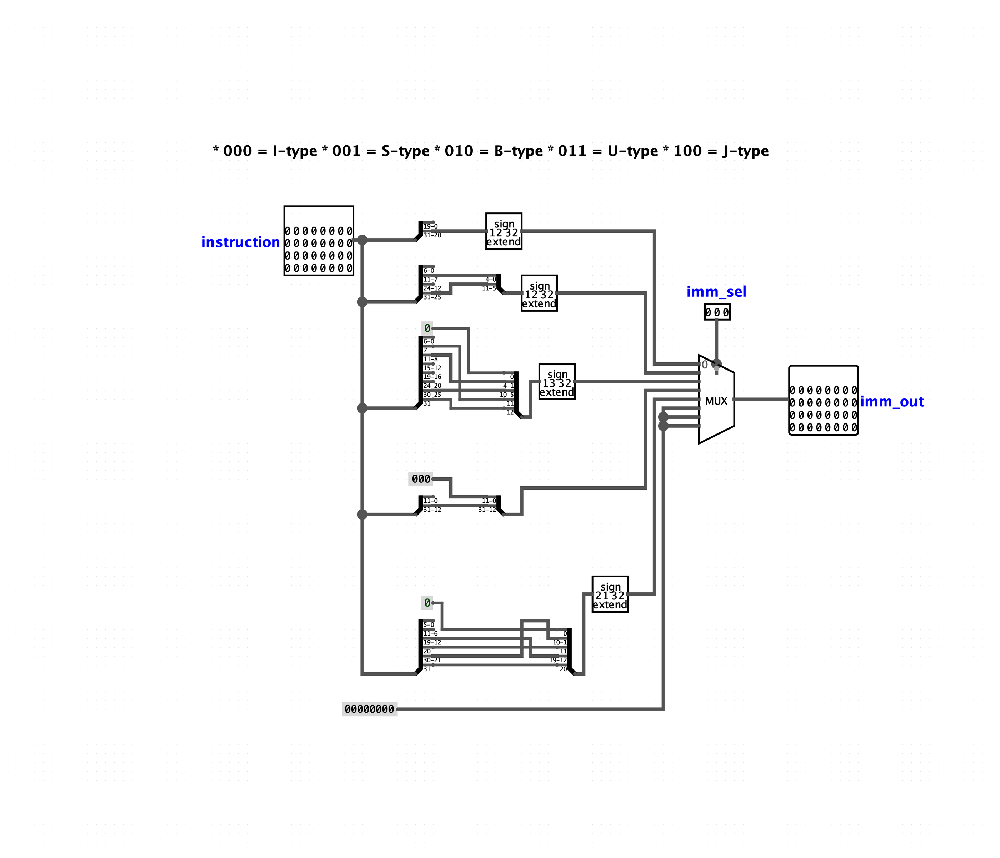

### Execute

**Arithmetic Logic Unit** — a bank of functional blocks (adder, subtractor, `A<B`
comparators, three shifters, bitwise gates) feeding a multiplexer chosen by the 4-bit
`alu_ctrl`; a comparator drives the `zero` flag.

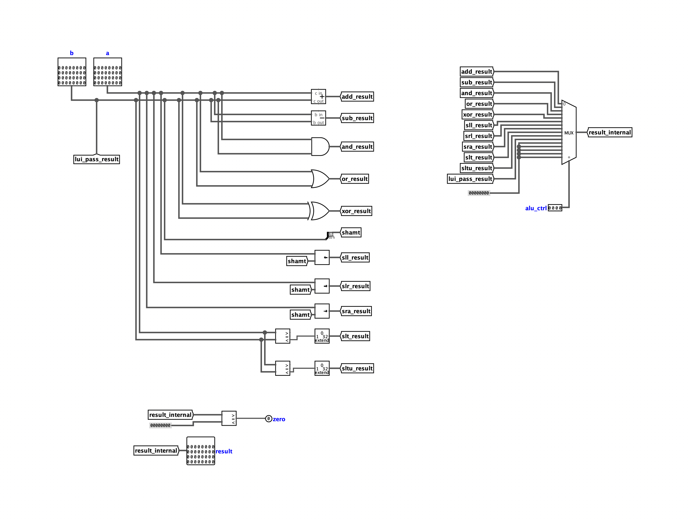

<table>
<tr>
<td width="50%" valign="top"><b>ALU Control</b><br/><sub>Refines <code>alu_op</code> with <code>funct3</code>/<code>funct7[5]</code> into the exact 4-bit ALU operation (e.g. <code>add</code> vs <code>sub</code>, <code>srl</code> vs <code>sra</code>).</sub><br/>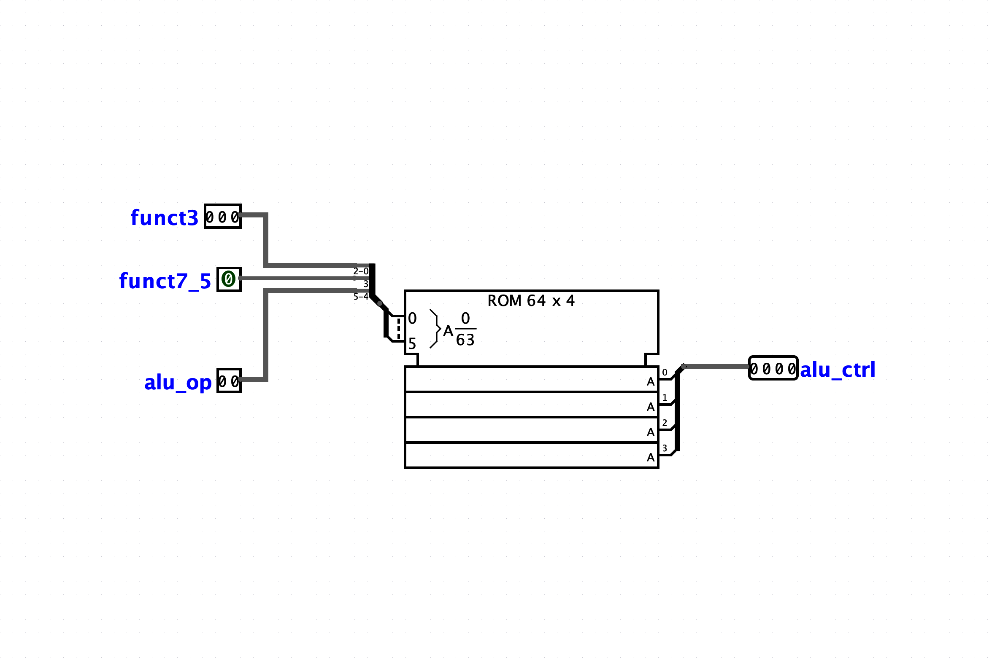</td>
<td width="50%" valign="top"><b>Branch Comparator</b><br/><sub>Evaluates the six branch conditions (<code>beq</code>…<code>bgeu</code>) and drives the branch-taken signal into the next-PC mux.</sub><br/>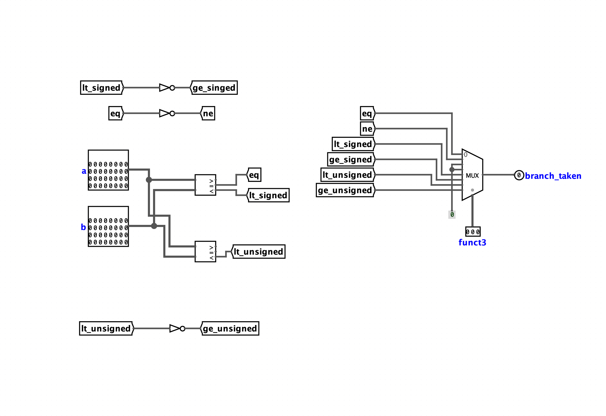</td>
</tr>
</table>

### Registers & memory

**Register File** — 32 general-purpose registers (`x0` hard-wired to 0). A decoder gated by
`reg_write` produces the write strobe; two multiplexers form the `rs1`/`rs2` read ports.

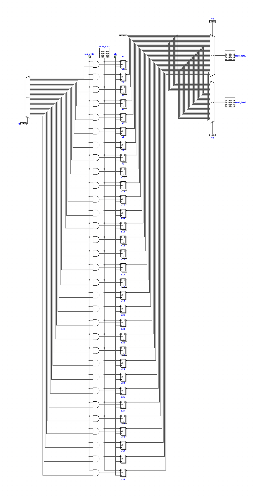

**Data Memory** — a 32-bit RAM with full sub-word access: `lb` `lh` `lw` `lbu` `lhu`
(correct sign/zero extension) and `sb` `sh` `sw`, all decoded from `funct3`.

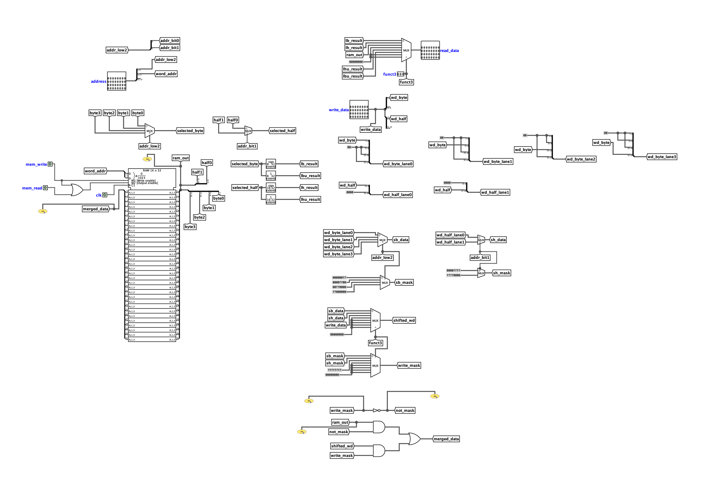

---

## Run it

> Requires [Logisim-Evolution 4.1.0+](https://github.com/logisim-evolution/logisim-evolution/releases).

1. Open **[`RV32I_CPU.circ`](RV32I_CPU.circ)** in Logisim-Evolution.
2. The top-level circuit is `CPU` (set as `main`) — select it in the explorer pane.
3. Load a program into the `Instruction_Memory` ROM (right-click → *Edit Contents…*), or
   use the bundled demo in **[`programs/`](programs/)**.
4. **Simulate → Reset Simulation**, then tick the clock (`Ctrl-T`, or enable auto-ticking).
5. Watch register values in `Register_File` and memory in `Data_Memory`.

---

## Verification

A short program is preloaded in the instruction ROM. It exercises fetch → decode → execute
→ write-back and includes a **negative immediate** to test sign extension:

```asm
addi x1, x0, 5      # 0x00500093   x1 = 5
addi x2, x1, 7      # 0x00708113   x2 = x1 + 7  = 12
addi x3, x2, -2     # 0xffe10193   x3 = x2 - 2  = 10
jal  x0, 0          # 0x0000006f   halt (branch to self)
```

After three clock ticks the register file reads:

| Register | `x1` | `x2` | `x3` |
|:--------:|:----:|:----:|:----:|
| Value    | `5`  | `12` | `10` |

This confirms PC increment, ROM fetch, opcode decode, I-type immediate generation
(positive **and** negative), the ALU adder, the register-file write port, and `x0`
staying zero. See **[`programs/README.md`](programs/README.md)** for the machine code and
how to assemble your own.

---

## Repository

```
.
├── RV32I_CPU.circ            # the processor — open this in Logisim-Evolution
├── docs/
│   ├── REPORT.md             # full project report & design write-up
│   ├── Project2_Assignment.pdf
│   └── images/               # circuit figures for every subcircuit
├── programs/                 # demo program: assembly, machine code, notes
├── tools/
│   └── logisim_export/       # Export.java + build.py — render the .circ to figures
├── README.md
└── LICENSE
```

---

## Documentation

- **[Full project report](docs/REPORT.md)** — design rationale, per-module description,
  control-signal tables, the ALU operation table, verification and design statistics.
- **[Programs](programs/README.md)** — the demo program and an assembly cheat-sheet.

The figures are reproducible: `python3 tools/logisim_export/build.py` re-renders every
subcircuit from `RV32I_CPU.circ` using Logisim-Evolution's own drawing engine.

---

<div align="center">

<sub>DAC-102 / DAE-101 · Project 2 · IIT Roorkee · 2026 — released under the
<a href="LICENSE">MIT License</a>.<br/>
RISC-V is an open standard maintained by <a href="https://riscv.org/">RISC-V International</a>.</sub>

</div>
