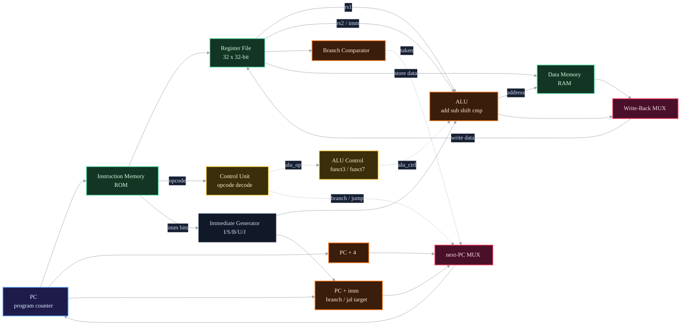

# RISC-V RV32I Microprocessor in Logisim-Evolution

<p align="center">
  
</p>

This repository is the submission for **DAC-102 / DAE-101 (2026), Project 2** at the
Mehta Family School of Data Science & Artificial Intelligence, IIT Roorkee. It contains a
fully working **single-cycle RISC-V processor** that executes the complete `RV32I` base
integer instruction set — every R, I, S, B, U and J-format instruction — with the only
exclusions being `ecall` and `ebreak`, exactly as the assignment specifies.

The processor is built entirely from logic primitives in
[Logisim-Evolution 4.1.0](https://github.com/logisim-evolution/logisim-evolution): there
is no behavioural HDL and no black-box CPU component. Every adder, multiplexer, register
and memory is wired by hand into ten self-contained subcircuits, which the top-level `CPU`
circuit composes into a working datapath. The file to open and grade is
[`RV32I_CPU.circ`](RV32I_CPU.circ).

A single instruction is fetched, decoded, executed, given memory access, and written back
**within one clock cycle**. This microarchitecture was chosen because it maps directly
onto the canonical RV32I datapath and makes the role of every control signal explicit.

---

## Contents

- [1. Architecture overview](#1-architecture-overview)
- [2. The datapath](#2-the-datapath)
- [3. Instruction set](#3-instruction-set)
- [4. Module reference](#4-module-reference)
- [5. Running the processor](#5-running-the-processor)
- [6. Verification](#6-verification)
- [7. Repository layout](#7-repository-layout)
- [8. Documentation](#8-documentation)

---

## 1. Architecture overview

| Property | Value |
|----------|-------|
| Microarchitecture | Single-cycle, Harvard (separate instruction and data memory) |
| Instruction set | RISC-V RV32I base integer (37 instructions, excluding `ecall`/`ebreak`) |
| Data width | 32-bit |
| Registers | 32 × 32-bit; `x0` hard-wired to zero |
| Endianness | Little-endian |
| Built from | 427 components and 1,315 wires across 10 subcircuits |
| Tool | Logisim-Evolution 4.1.0 |

The design follows the five classic stages of a RISC datapath, all active within one
clock cycle: **fetch → decode → execute → memory → write-back**, with a feedback path
that selects the next program counter.

---

## 2. The datapath

The top-level `CPU` circuit wires the ten subcircuits together as follows. Solid edges
carry data and buses; dashed edges carry control signals from the decoders.



The figure below is the **actual top-level circuit**, rendered straight from
`RV32I_CPU.circ` with Logisim-Evolution's own drawing engine and then recoloured
to the vivid dark theme (see [`tools/logisim_export/`](tools/logisim_export/) —
white = components, cyan = wires/buses, yellow = pins). Every block is one of the
ten subcircuits, wired into the datapath through named tunnels (`instruction`,
`imm_out`, `alu_result`, …).


| Stage | Subcircuits | Job |
|-------|-------------|-----|
| **Fetch** | `PC`, `Instruction_Memory` | Hold the program counter, read the 32-bit instruction, compute `PC+4`. |
| **Decode** | `Control_Unit`, `Imediate_Generator`, `Register_File` | Decode the opcode into control signals, sign-extend the immediate, read `rs1`/`rs2`. |
| **Execute** | `ALU`, `ALU_Control`, `Branch_Comparator` | Compute the arithmetic/logic result; resolve the branch condition. |
| **Memory** | `Data_Memory` | Byte/half/word loads and stores into RAM. |
| **Write-back** | multiplexing in `CPU` | Write the ALU result, memory data, or `PC+4` back to `rd`. |

---

## 3. Instruction set

All 37 base-integer instructions are supported (everything in RV32I except
`ecall`, `ebreak` and `fence`). The `Control_Unit` ROM holds a decode entry for every one
of the nine RV32I opcode groups (`0x03 0x13 0x17 0x23 0x33 0x37 0x63 0x67 0x6F`).

| Format | Instructions |
|--------|--------------|
| **R-type** | `add` `sub` `sll` `slt` `sltu` `xor` `srl` `sra` `or` `and` |
| **I-type (ALU)** | `addi` `slti` `sltiu` `xori` `ori` `andi` `slli` `srli` `srai` |
| **I-type (load)** | `lb` `lh` `lw` `lbu` `lhu` |
| **I-type (jump)** | `jalr` |
| **S-type (store)** | `sb` `sh` `sw` |
| **B-type (branch)** | `beq` `bne` `blt` `bge` `bltu` `bgeu` |
| **U-type** | `lui` `auipc` |
| **J-type** | `jal` |

---

## 4. Module reference

Every schematic below is the real subcircuit, exported directly from
`RV32I_CPU.circ` with Logisim-Evolution and recoloured to the vivid dark theme —
so what you see is exactly what is wired in the `.circ`. In the colour scheme,
**white** is components (adder, subtractor, `A<B` comparators, shifters,
bit-extenders, ROM/RAM, multiplexers and named tunnels), **cyan** is the
wires and buses, and **yellow** marks the circuit's input/output pins.

### Arithmetic Logic Unit
Computes every RV32I integer operation. A bank of dedicated functional blocks feeds a
multiplexer that selects the result from the 4-bit `alu_ctrl` code; a comparator drives
the `zero` flag used by the branch logic.


### Register File
32 general-purpose registers (`x0` is a hard-wired constant zero). A decoder gated by
`reg_write` produces the per-register write strobe; two multiplexers form the `rs1`/`rs2`
read ports. Writes are clocked, reads are combinational.


### Immediate Generator
Reassembles and sign-extends the immediate for all five immediate formats, selected by the
3-bit `imm_sel` from the control unit.


### Control Unit
A ROM that maps the 7-bit opcode to the full bundle of control signals
(`reg_write`, `alu_src`, `mem_read`, `mem_write`, `mem_to_reg`, `branch`, `jump`,
`alu_op`, `imm_sel`).


### ALU Control
A second ROM that refines `alu_op` using `funct3` and `funct7[5]` into the exact 4-bit ALU
operation — distinguishing `add`/`sub` and `srl`/`sra`.


### Data Memory
A 32-bit RAM with full sub-word access: `lb`, `lh`, `lw`, `lbu`, `lhu` (correct sign/zero
extension) and `sb`, `sh`, `sw`, all decoded from `funct3`.


### Branch Comparator
Evaluates the six branch conditions (`beq`, `bne`, `blt`, `bge`, `bltu`, `bgeu`) and drives
the branch-taken signal into the next-PC multiplexer.


### Program Counter & Instruction Memory

<table>
<tr>
<td></td>
<td></td>
</tr>
</table>

---

## 5. Running the processor

> Requires [Logisim-Evolution 4.1.0 or newer](https://github.com/logisim-evolution/logisim-evolution/releases).

1. Open [`RV32I_CPU.circ`](RV32I_CPU.circ) in Logisim-Evolution.
2. The top-level circuit is `CPU` (set as `main`) — select it in the explorer pane.
3. Load a program into the `Instruction_Memory` ROM (right-click → *Edit Contents…*), or
   use the bundled demo in [`programs/`](programs/).
4. **Simulate → Reset Simulation**, then tick the clock (**Simulate → Tick**, `Ctrl-T`,
   or enable auto-ticking).
5. Observe register values in `Register_File` and memory contents in `Data_Memory`.

---

## 6. Verification

A short program is preloaded in the instruction ROM. It exercises the fetch/decode/
execute/write-back loop and includes a **negative immediate** to test sign extension:

```asm
addi x1, x0, 5      # 0x00500093   x1 = 5
addi x2, x1, 7      # 0x00708113   x2 = x1 + 7  = 12
addi x3, x2, -2     # 0xffe10193   x3 = x2 - 2  = 10
jal  x0, 0          # 0x0000006f   halt (branch to self)
```

After three clock ticks the register file holds `x1 = 5`, `x2 = 12`, `x3 = 10`, with the
PC parked on the final `jal`. This confirms PC increment, ROM fetch, opcode decode,
I-type immediate generation (positive and negative), the ALU adder, the register-file
write port, and `x0` remaining zero. See [`programs/README.md`](programs/README.md) for the
machine code and how to assemble your own program.

---

## 7. Repository layout

```
.
├── RV32I_CPU.circ            # the processor — open this in Logisim-Evolution
├── docs/
│   ├── REPORT.md             # full project report and design write-up
│   ├── Project2_Assignment.pdf
│   └── images/               # dark-theme renders of every subcircuit (PNG)
├── programs/                 # demo program: assembly, machine code, notes
├── tools/
│   └── logisim_export/       # Export.java + build.py: render the .circ to the
│                             # dark-theme images used in these docs
├── README.md
└── LICENSE
```

---

## 8. Documentation

- **[Full project report](docs/REPORT.md)** — design rationale, per-module description,
  control-signal tables, the ALU operation table, verification and design statistics.
- **[Programs](programs/README.md)** — the demo program and an assembly cheat-sheet.

---

*Submitted for DAC-102 Project 2, IIT Roorkee — 2026. RISC-V is an open standard
maintained by [RISC-V International](https://riscv.org/).*
