# Project Report — A Single-Cycle RV32I Microprocessor in Logisim-Evolution

**Course:** DAC-102 / DAE-101 (2026) · Project 2
**Institution:** Mehta Family School of Data Science & Artificial Intelligence, IIT Roorkee
**Tool:** Logisim-Evolution 4.1.0
**Deliverable:** `RV32I_CPU.circ`

---

## 1. Objective

Implement a microprocessor in Logisim-Evolution capable of executing all **RV32I
(base integer)** instructions, with the sole exceptions of `ecall` and `ebreak`.

The design presented here is a **single-cycle** processor: each machine instruction
completes — fetch through write-back — in exactly one clock cycle. This microarchitecture
was chosen because it maps cleanly onto the RV32I datapath and makes the role of every
control signal explicit, which is ideal for a teaching/assessment context.

---

## 2. Design philosophy

The CPU is built **hierarchically**. Rather than one enormous flat schematic, the design
is decomposed into ten focused subcircuits, each with a well-defined interface (input and
output pins) and a single responsibility. The top-level `CPU` circuit then instantiates
these blocks and wires them into the datapath.

This brings three benefits:

1. **Readability** — each unit fits on screen and can be reasoned about in isolation.
2. **Testability** — a subcircuit (e.g. the ALU) can be poked independently.
3. **Reuse** — the immediate generator, register file etc. are drop-in components.

Two control decoders are implemented as **ROM look-up tables** (`Control_Unit` and
`ALU_Control`). Encoding control logic as a ROM is a standard, transparent technique:
the truth table *is* the memory contents, so the decode behaviour is data, not a tangle of
gates — easy to read, verify and extend.

---

## 3. Top-level datapath

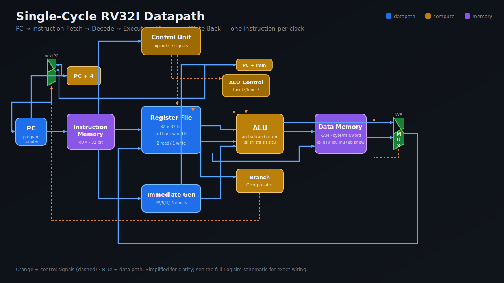

The single clock cycle proceeds conceptually through five stages, all active
simultaneously within the cycle:

1. **Instruction Fetch.** The `PC` register drives the `Instruction_Memory` ROM, which
   returns the 32-bit instruction. In parallel an adder computes `PC + 4`.
2. **Decode.** The opcode (`instruction[6:0]`) indexes the `Control_Unit` ROM, producing
   every control signal at once. The `Imediate_Generator` reconstructs the immediate for
   the instruction's format, and the `Register_File` reads `rs1` and `rs2`.
3. **Execute.** The `ALU_Control` ROM converts `alu_op` + `funct3` + `funct7[5]` into the
   4-bit ALU operation. The `ALU` computes on operand A (`rs1`) and operand B
   (`rs2` or the immediate, chosen by `alu_src`). The `Branch_Comparator` evaluates the
   branch condition in parallel.
4. **Memory.** For loads/stores the ALU result is the address into `Data_Memory`, which
   handles byte, half-word and word accesses with correct sign/zero extension.
5. **Write-back.** A multiplexer selects what is written to `rd`: the ALU result, data
   read from memory (`mem_to_reg`), or `PC + 4` (for `jal`/`jalr`).

Finally, the **next-PC** multiplexer chooses between `PC + 4` (sequential), the branch /
`jal` target (`PC + immediate`), or the `jalr` target, based on `branch`, `jump` and the
branch-comparator result.

The complete, as-wired top-level schematic:

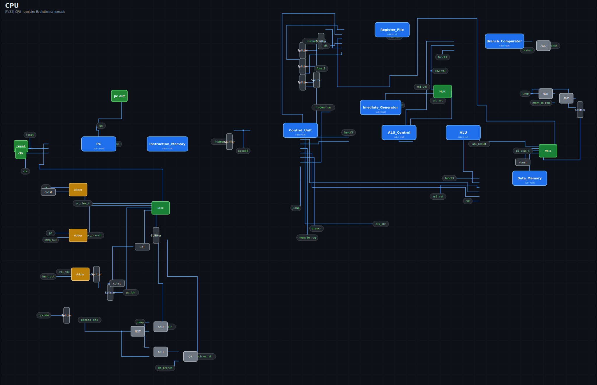

---

## 4. Module-by-module description

### 4.1 Program Counter (`PC`)
A 32-bit `Register` with a multiplexer on its input for synchronous **reset** (clears the
PC to 0) and a clock input. On each rising clock edge it latches `next_pc`. This is the
only architectural state on the fetch path.

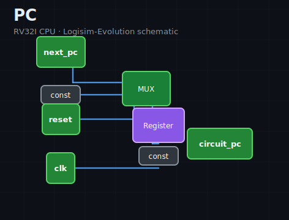

### 4.2 Instruction Memory (`Instruction_Memory`)
A 32-bit-wide `ROM` addressed by the PC. RV32I instructions are word-aligned, so the ROM
is indexed by the upper PC bits. It is purely combinational — the instruction appears as
soon as the address is stable.

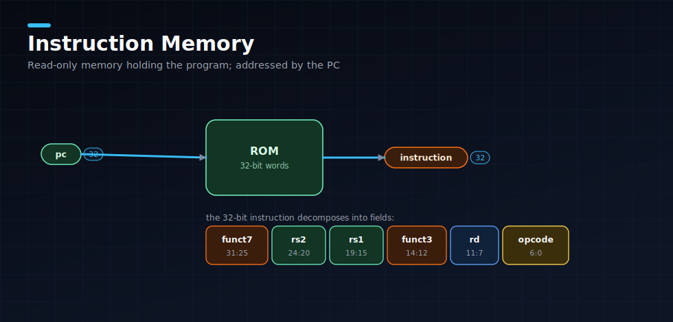

### 4.3 Control Unit (`Control_Unit`)
The main decoder. A 7-bit opcode addresses a ROM whose 12-bit output is split (via a
`Splitter`) into the individual control signals:

| Signal | Purpose |
|--------|---------|
| `reg_write` | Enable the register-file write port |
| `alu_src` | Select ALU operand B: register (`0`) or immediate (`1`) |
| `mem_read` / `mem_write` | Data-memory read / write enables |
| `mem_to_reg` | Write-back source: ALU result (`0`) or memory data (`1`) |
| `branch` | Instruction is a conditional branch |
| `jump` | Instruction is `jal`/`jalr` |
| `alu_op[1:0]` | High-level ALU class passed to the ALU control |
| `imm_sel[2:0]` | Immediate format selector for the immediate generator |

Decode entries exist for all nine RV32I opcode groups:

| Opcode | Group | Notes |
|--------|-------|-------|
| `0x33` | R-type | register-register ALU |
| `0x13` | I-type ALU | immediate ALU |
| `0x03` | Load | `alu_src=1`, address = `rs1 + imm` |
| `0x23` | Store | `alu_src=1`, `mem_write=1` |
| `0x63` | Branch | `branch=1`, ALU does subtract for comparison |
| `0x6F` | JAL | `jump=1`, write `PC+4`, target `PC+imm` |
| `0x67` | JALR | `jump=1`, target `rs1+imm` |
| `0x37` | LUI | load upper immediate (ALU pass-through) |
| `0x17` | AUIPC | add upper immediate to PC |

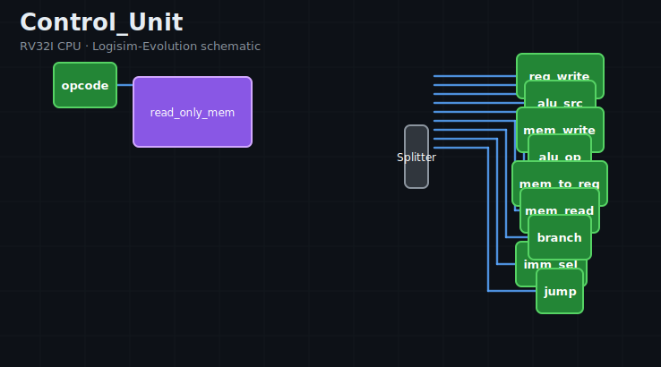

### 4.4 Immediate Generator (`Imediate_Generator`)
RV32I scatters immediate bits differently across each format. This unit uses splitters and
bit-extenders to reassemble and **sign-extend** the immediate, then a multiplexer selects
the correct format via `imm_sel`:

| `imm_sel` | Format | Used by |
|-----------|--------|---------|
| `000` | I-type | ALU-immediate, loads, `jalr` |
| `001` | S-type | stores |
| `010` | B-type | branches |
| `011` | U-type | `lui`, `auipc` |
| `100` | J-type | `jal` |

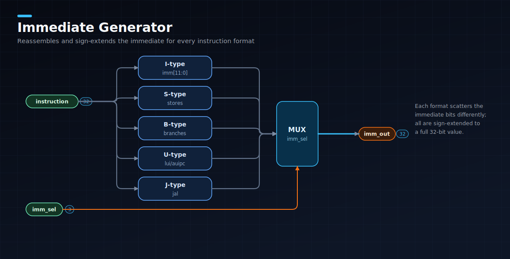

### 4.5 Register File (`Register_File`)
32 architectural registers, each 32 bits. Implemented as **31 hardware `Register`s** plus
`x0`, which is permanently tied to the constant `0` (writes to `x0` are discarded). A
`Decoder` on `rd` combined with the `reg_write` enable (and per-register AND gates)
produces 31 individual write-enable strobes. Two large multiplexers form the `rs1` and
`rs2` read ports. Writes are clocked; reads are combinational.

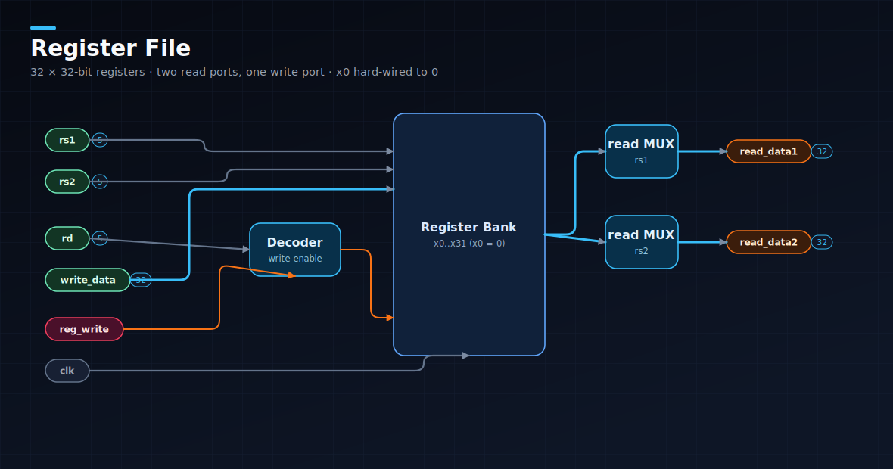

### 4.6 ALU Control (`ALU_Control`)
A ROM addressed by `{alu_op[1:0], funct7[5], funct3[2:0]}` (6 bits) that emits the 4-bit
`alu_ctrl` operation code. This is what disambiguates instructions that share a `funct3`:
`add` vs `sub` (R-type `funct7[5]`), and `srl` vs `sra` (shift-right logical vs arithmetic).

| `alu_op` | Meaning |
|----------|---------|
| `00` | Force **ADD** (loads, stores, `jalr`, address generation) |
| `01` | Force **SUB** (branch comparison) |
| `10` | Decode fully from `funct3`/`funct7` (R-type and I-type ALU) |
| `11` | Pass-through / upper-immediate path (`lui`) |

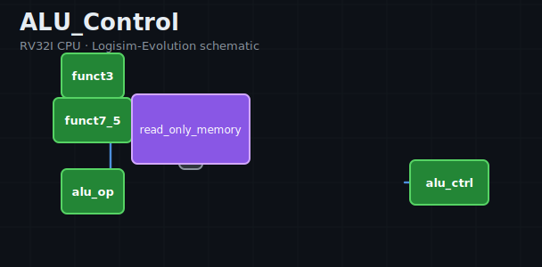

### 4.7 Arithmetic Logic Unit (`ALU`)
The compute core. It contains a dedicated functional block for each operation —
`Adder`, `Subtractor`, bitwise `AND`/`OR`/`XOR` gates, three `Shifter`s (logical-left,
logical-right, arithmetic-right) and `Comparator`s for signed and unsigned `slt`/`sltu` —
and a final multiplexer that selects the result according to the 4-bit `alu_ctrl`:

| `alu_ctrl` | Op | | `alu_ctrl` | Op |
|:---:|:---|---|:---:|:---|
| `0` | ADD | | `5` | SLL |
| `1` | SUB | | `6` | SRL |
| `2` | AND | | `7` | SRA |
| `3` | OR  | | `8` | SLT (signed) |
| `4` | XOR | | `9` | SLTU (unsigned) |
| | | | `a` | pass B (LUI) |

A separate comparator drives the `zero` output, used by the branch logic.

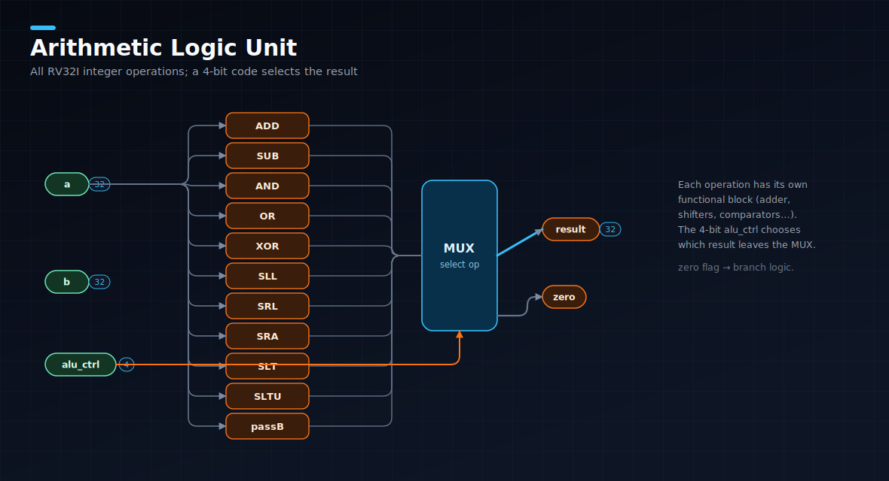

### 4.8 Branch Comparator (`Branch_Comparator`)
Takes `rs1`, `rs2` and `funct3` and produces a single `branch_taken` bit implementing the
six branch conditions (`beq`, `bne`, `blt`, `bge`, `bltu`, `bgeu`) using signed and
unsigned comparators plus a small amount of selection logic. Gating this with the
`branch` control signal decides whether the next-PC mux takes the branch target.

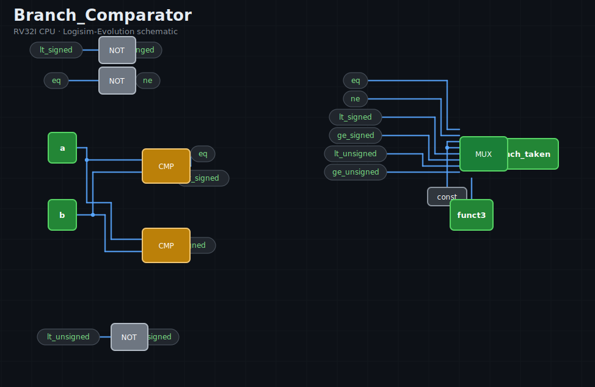

### 4.9 Data Memory (`Data_Memory`)
A word-addressed `RAM` with full sub-word support. On the read path, `funct3` selects
between byte / half / word and signed / unsigned extension (`lb`, `lh`, `lw`, `lbu`,
`lhu`) via bit-extenders and multiplexers. On the write path it builds the correct
byte-enable / merge for `sb`, `sh`, `sw`. Reads are combinational; writes are clocked and
gated by `mem_write`.

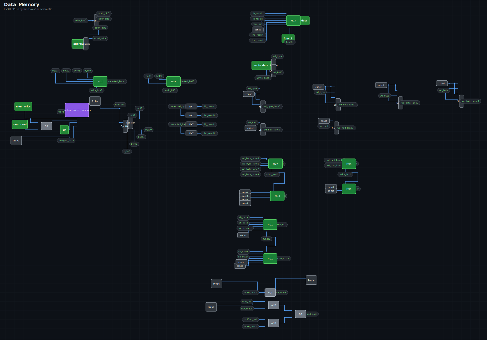

---

## 5. Verification

A short demo program is preloaded in the instruction ROM to exercise the fetch/decode/
execute/write-back loop, including a **negative** immediate (testing sign extension):

```asm
addi x1, x0, 5      # 0x00500093   x1 = 5
addi x2, x1, 7      # 0x00708113   x2 = x1 + 7  = 12
addi x3, x2, -2     # 0xffe10193   x3 = x2 - 2  = 10
jal  x0, 0          # 0x0000006f   halt (branch to self)
```

**Expected end state:** `x1 = 5`, `x2 = 12`, `x3 = 10`, with the PC parked on the final
`jal`. Stepping the clock in Logisim-Evolution and observing the register file confirms
this, validating: PC increment, ROM fetch, opcode decode, I-type immediate generation
(positive **and** negative), the ALU adder, the register-file write port, and `x0`
remaining zero.

Each subcircuit was additionally validated in isolation by driving its input pins and
inspecting outputs (e.g. confirming the ALU mux selects the right functional unit for
each `alu_ctrl` code, and that the immediate generator sign-extends each format correctly).

---

## 6. Design statistics

| Subcircuit | Components | Wires |
|------------|-----------:|------:|
| `PC` | 8 | 11 |
| `Instruction_Memory` | 4 | 7 |
| `Control_Unit` | 12 | 30 |
| `Imediate_Generator` | 22 | 77 |
| `Register_File` | 74 | 506 |
| `ALU_Control` | 6 | 8 |
| `ALU` | 51 | 127 |
| `Branch_Comparator` | 26 | 50 |
| `Data_Memory` | 137 | 261 |
| `CPU` (top-level) | 87 | 238 |
| **Total** | **427** | **1,315** |

---

## 7. Limitations and possible extensions

- **Single-cycle.** The clock period is bounded by the slowest instruction's full path.
  A multi-cycle or pipelined reorganisation would raise throughput but adds hazard/control
  complexity that is out of scope here.
- **No `ecall` / `ebreak`** — excluded by the assignment; there is no trap/CSR machinery.
- **Fixed memory sizes.** Instruction ROM and data RAM are sized for course programs and
  can be enlarged in Logisim if needed.
- **Future work.** Natural extensions are a 5-stage pipeline with forwarding, a hazard
  unit, and the Zicsr/`ecall` support needed to run under a minimal runtime.

---

## 8. How to reproduce the schematics

All schematic images in this report are generated programmatically from the `.circ` file
(component coordinates, wires and labels) by [`tools/render_circuits.py`](../tools/render_circuits.py):

```bash
python3 tools/render_circuits.py RV32I_CPU.circ docs/images
```

This guarantees the figures match the actual circuit rather than a hand-drawn idealisation.

---

*Prepared as the submission for DAC-102 Project 2. The processor file to be opened and
graded is `RV32I_CPU.circ`.*
